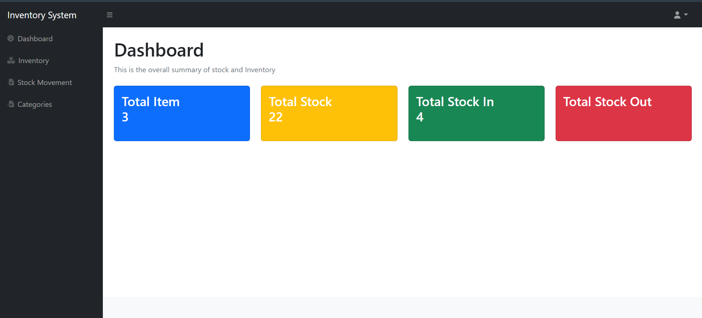

# Simple Storage System

## 📌 Project Overview

A web-based storage management system built using **PHP, MySQL, and Bootstrap**. This project provides an interface for managing inventory, tracking stock movements, and handling categories efficiently.

## ✨ Features

### 🔑 User Authentication

- Login system with credential validation (session not saved, restricted access).
- Logout function using PHP session handling.
- Password reset functionality to update credentials in the database.

### 🏗️ Web Design & Layout

- Utilized **Bootstrap** for responsive design.
- Implemented a **fixed sidebar navigation** for easy access to different sections.
- Used `header.php` and `footer.php` for reusability across pages.

### 📦 Inventory Management

- Queried inventory data from **MySQL database**.
- CRUD operations:
  - **Create**: Add new items with name, description, image, category, and quantity.
  - **Read**: Display inventory items in a structured table.
  - **Update**: Edit existing items (name, description, image, category, quantity).
  - **Delete**: Remove items from the inventory.

### 📊 Stock Movement Tracking

- Displays **stock transactions** (Stock In/Out).
- Updates inventory quantities dynamically.
- Tracks transaction details such as **Stock Type (In/Out), Serial Number, Item Name, Description, Quantity, and Timestamp**.

### 🏷️ Category Management

- Displays available categories queried from the database.
- Allows users to **add** new categories.
- **Deleting a category** removes associated inventory items for data consistency.

### 📊 Dashboard Analytics

- Displays **real-time stats**:
  - Total items
  - Total stock quantity
  - Stock-in count
  - Stock-out count

### 🛢️ Database Structure (MySQL)

The system uses four tables:

1. **users** – Stores user credentials.
2. **inventory** – Manages item details.
3. **stock_movement** – Logs stock transactions.
4. **category** – Holds category details.

## 🚀 Installation & Setup

### Prerequisites

- **XAMPP** or any local PHP server.
- **phpMyAdmin** for database management.

### Steps to Run Locally

1. **Clone the repository**:
   ```sh
   git clone https://github.com/yourusername/simple-storage-system.git
   cd simple-storage-system
   ```
2. **Start the server**:
   - Open XAMPP and start **Apache** & **MySQL**.
3. **Import the database**:
   - Open `phpMyAdmin` → Create a new database (`storage_db`).
   - Import the provided `storage_db.sql` file.
4. **Run the project**:
   - Place the project in `htdocs` folder (if using XAMPP).
   - Open a browser and go to `http://localhost/simple-storage-system`.

## 🛠️ Technologies Used

- **Frontend**: HTML, CSS (Bootstrap)
- **Backend**: PHP
- **Database**: MySQL (phpMyAdmin)

## 📷 Screenshots


## 📌 Future Improvements

- Implement **session management** for persistent login.
- Improve security with **password hashing**.
- Add user roles (Admin, Staff) for better access control.

## 📄 License

This project is open-source and available under the **MIT License**.

---

Made with ❤️ by Amir Hamzah
